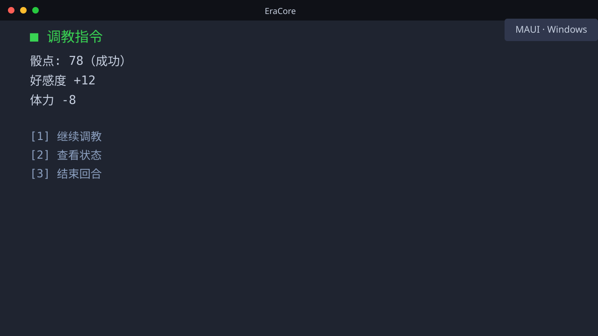
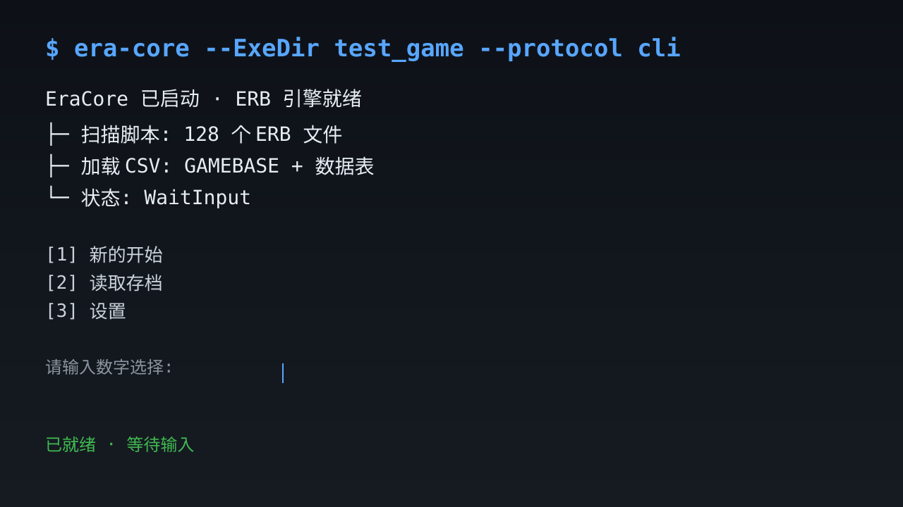
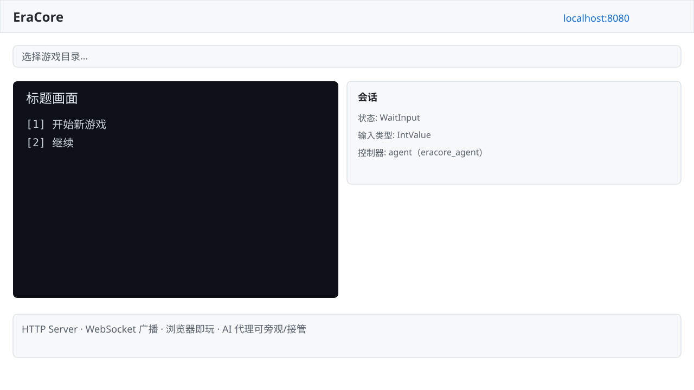

# EraCore

一款基于 **.NET 的 Eramaker 引擎 C# 移植版（Emuera 精神续作）**，完整支持 ERB 脚本语言，并提供跨平台的多端体验。

> 本项目最初 fork 自 **EvilMask 的 [Emuera.EM](https://github.com/EMHMark/Emuera.EM)** 项目，致力于在保留原汁原味 Emuera 体验的同时，迈向模块化、可扩展、可自动化与被 AI 操控的新一代架构。

---

## 特性亮点

- **模块化架构，易于扩展** — 引擎（`EraCore.Core`）、服务（`EraCore.Server`）、入口（`EraCore.Cli`）、界面（`EraCore.Maui` / `EraCore.Web`）彻底解耦。让内核完全无头，接不同前端只需实现统一协议。
- **无头运行器 + CLI 模式** — 无需图形界面即可运行游戏。内置 HTTP 服务器与 JSONL 协议，脚本、自动化、**AI 代理（`eracore_agent`）**都能直接操控游戏。
- **轻量级 Web 前端** — 基于 Vue 3 + TypeScript 的纯浏览器界面，任意现代浏览器打开即玩，支持 WebSocket 实时旁观与接管。
- **跨平台** — Windows 桌面（原生 MAUI）、Android（APK，可选 NativeAOT 原生加速）、浏览器（Web SPA）一套引擎多处体验。
- **完整 ERB 支持** — 继承自 Emuera 的语言特性：变量表、指令系统、函数方法、图片/音频/精灵、数据表等等。

---

## 截图预览

| Windows/Android 桌面（MAUI） | CLI 交互模式 | Web 前端（Server 模式） |
| --- | --- | --- |
|  |  |  |

> 当前为占位图，将在正式版替换为真实截图。

---

## 快速开始

### 最简单的玩法：一次性拉起本地服务器，浏览器开玩

```bash
# 构建 CLI 入口
dotnet build EraCore.Cli/EraCore.Cli.csproj -c Debug

# 启动 HTTP 服务器
dotnet exec EraCore.Cli/bin/Debug/net10.0/EraCore.Cli.dll --ExeDir test_game --server --port 8080
```

浏览器访问 <http://localhost:8080> 即可开始游戏。

### 环境要求

- [.NET 10 SDK](https://dotnet.microsoft.com/download) 或更高版本
- Python 3.10+（用于 `eracore_agent` CLI 和测试）
- Node.js 18+（用于 Web 前端 `EraCore.Web/`）
- Windows（跨平台支持计划中，目前仅完成 Windows）

---

## 支持平台与运行模式

| 运行模式 | 入口 | 说明 |
| --- | --- | --- |
| CLI 交互模式 | `EraCore.Cli` | 终端直接游玩，需真实 TTY |
| HTTP Server | `EraCore.Cli --server` | 本地/局域网 Web 服务，浏览器即玩 |
| Windows 桌面 | `EraCore.Maui` | 原生窗口体验，内置 WebView |
| Android APK | `EraCore.Maui` | 移动端游玩（支持 NativeAOT 加速） |
| AI 代理 | `eracore_agent` | 无头操控，供自动化与 AI 使用 |

---

## 文档

- **架构总览** → [ARCHITECTURE.md](ARCHITECTURE.md)
- **Web 前端开发** → [EraCore.Web/README.md](EraCore.Web/README.md)
- **测试套件** → [tests/README.md](tests/README.md)
- **领域术语表** → [CONTEXT.md](CONTEXT.md)
- **终端行为经验** → [docs/LESSONS/terminal-windows.md](docs/LESSONS/terminal-windows.md)
- **项目维护说明** → [CLAUDE.md](CLAUDE.md)

审查、规划、实现、测试、文档维护等内部流程，见 `.agents/skills/` 提供的专业 skill。

---

## Agent 集成（CLI + Skill）

Agent 通过中转 CLI `eracore_agent` 操控游戏，不走 MCP。礼仪见 [`.agents/skills/eracore-playtesting/SKILL.md`](.agents/skills/eracore-playtesting/SKILL.md)。

```text
agent
  └─ eracore_agent   (python -m eracore_agent <subcommand>
                     或安装后的 eracore_agent)
       └─ HTTP      /load-game /turn /input /state /control/*
            └─ EraCore.Server 或 MAUI 托管的 HttpListenerHost（issue 05，agent 自动侦测复用）
                 ├─ EraCore.Core（共享层 Server/：协议 + 控制状态机 + 会话）
                 └─ GET /ws  →  Web 旁观（MAUI 托管 server 亦暴露同契约 /ws）
```

`start` 自己拉起 `EraCore.Cli --server`，或复用已经在跑的实例（含 MAUI 应用托管的 server——读 `%LOCALAPPDATA%\Emuera\emuera-maui-server.json` 发现记录）。

```bash
python -m eracore_agent start --game-dir test_game
python -m eracore_agent acquire
python -m eracore_agent step --value 0
python -m eracore_agent release
python -m eracore_agent status
python -m eracore_agent watch
python -m eracore_agent stop
```

| 子命令 | 作用 |
|--------|------|
| `start` | 拉起或复用 server，加载游戏，返回初始 turn |
| `acquire` | 获取控制权，并返回 drain 后的状态确认 |
| `step --value X` | 提交输入并读取下一回合 |
| `release` | 让出控制权（不关 server） |
| `status` | 查询当前 Controller 与游戏 state |
| `watch` | 只读旁观终端输出 |
| `stop` | 结束会话；若由本 CLI 拉起则同时停 server |

配置不要提交：

| 文件 | 内容 |
|------|------|
| `.eracore-agent.json` | 路径预设（`binaryPath` / `gameDir`） |
| `.eracore-server.json` | 本次运行记录（`host` / `port` / `pid` / `token` / `gameDir` / `startedByAgent`）。`start` 写入，`stop` 删除，`release` 不删 |

### 响应格式

stdout 是一行 JSON。`start` / `step` 输出 turn：

```json
{
  "state": "WaitInput",
  "inputType": "IntValue",
  "needValue": true,
  "protocolVersion": 11,
  "diff": { "lineOps": [], "bgColor": null }
}
```

`acquire` 另带控制权确认：

```json
{
  "controller": { "kind": "agent" },
  "state": "WaitInput",
  "turn": { "state": "WaitInput", "inputType": "IntValue", "needValue": true },
  "turnsAdvanced": 0
}
```

| 字段 | 说明 |
|------|------|
| `state` | `WaitInput` / `Running` / `Quit` / `Error` / `Idle` |
| `inputType` | `IntValue` / `StrValue` / `EnterKey` / `AnyKey` / `AnyValue` / `IntButton` / `StrButton` |
| `needValue` | `true` 时需要非空输入 |
| `diff` | 相对上一回合的行级增量；首回合为 `null`，全屏细节用 `GET /snapshot` |
| `turnsAdvanced` | `acquire` 时 drain 掉的积压回合数 |

错误走 stderr + 非零退出码（例如 `CONTROL_LOST`、`CONTROL_HELD_BY_USER`）。回合字段的权威来源是 `TurnRecord` / `AgentJsonlProtocol`。

---

## JSONL 协议

无头运行器的 JSONL 协议由 server 模式（`--server`）通过 HTTP 暴露，适合脚本和自动化。创建会话后游戏自动输出初始 turn，之后每发送一条输入命令返回一个 turn。

```python
# 游戏自动输出初始 turn（无需发送任何命令）：
{"text": "标题画面...", "state": "WaitInput", "inputType": "IntValue", "needValue": true, "buttons": [...]}

# 客户端发送输入：
{"type": "input", "value": "0"}

# 服务器响应下一 turn：
{"text": "输出文本...", "state": "WaitInput", "inputType": "IntValue", "needValue": true, "buttons": [...]}
```

参考 `tests/emuera_server.py`（server 模式测试 helper）和 `tests/test_jsonl.py`（示例）。

---

## 构建

### CLI & Server 模式（共享 `EraCore.Cli`）

```bash
dotnet build EraCore.Cli/EraCore.Cli.csproj -c Debug
```

发布单文件：

```bash
dotnet publish EraCore.Cli/EraCore.Cli.csproj -c Release --no-self-contained -o publish/cli
```

### MAUI Windows 桌面应用

```bash
dotnet build EraCore.Maui/EraCore.Maui.csproj -f net10.0-windows10.0.19041.0 -c Debug
```

MAUI 不支持 `PublishSingleFile`。发布需框架依赖或独立部署：

```bash
dotnet publish EraCore.Maui/EraCore.Maui.csproj -f net10.0-windows10.0.19041.0 -c Release
dotnet publish EraCore.Maui/EraCore.Maui.csproj -f net10.0-windows10.0.19041.0 -c Release --self-contained -r win-x64
```

### Android APK

```bash
dotnet publish EraCore.Maui/EraCore.Maui.csproj -f net10.0-android -c Release
```

需要 Android SDK + JDK 17+（`JAVA_HOME`）环境。

#### Android NativeAOT（PublishAot）

NativeAOT 将托管代码编译为原生 so（APK 内 0 托管 dll，仅 `lib/<abi>/libEmuera.Maui.so`），启动更快、包体更小，但构建更慢、对反射/序列化有限制。实验验证（2026-08-08）：MuMu 模拟器 + 真机 arm64 均可运行。

```powershell
# x64（模拟器，如 MuMu）——单行命令，PowerShell 不认 bash 的 `\` 续行符
# 必须带 -p:TreatWarningsAsErrors=false：Core 项目 TreatWarningsAsErrors=true，
# 其 ILC 警告（IL2026/IL3050/IL2072，均为已登记豁免清单）会被提升为 error 导致构建失败
dotnet publish EraCore.Maui/EraCore.Maui.csproj -f net10.0-android -r android-x64 -c Release -p:PublishAot=true -p:RunAOTCompilation=false -p:AndroidPackageFormats=apk -p:PublishDir=artifacts/nativeaot/maui-android-x64/ -p:TreatWarningsAsErrors=false -p:SkipVueBuild=true

# arm64（真机）
dotnet publish EraCore.Maui/EraCore.Maui.csproj -f net10.0-android -r android-arm64 -c Release -p:PublishAot=true -p:RunAOTCompilation=false -p:AndroidPackageFormats=apk -p:PublishDir=artifacts/nativeaot/maui-android-arm64/ -p:TreatWarningsAsErrors=false -p:SkipVueBuild=true
```

**关键约束（务必遵守）：**

1. **目录隔离**：`EraCore.Maui/Directory.Build.props` 在 `PublishAot=true` 时自动把中间产物/输出重定向到 `obj-aot/`/`bin-aot/`，并补回 `DefaultItemExcludes`（`obj/**;bin/**`）——**NativeAOT 与普通构建（Mono Full AOT）互不污染**。不要手动传 `-p:BaseIntermediateOutputPath`（全局属性会传染 Core 项目，且破坏 SDK 默认排除导致 CS0579）。
2. **JSON 序列化必须走源生成**：NativeAOT 下 `System.Text.Json` 反射序列化被禁用（`JsonSerializerIsReflectionDisabled` 抛异常）。壳层消息已迁移到 `EraCore.Maui/Json/MauiJsonContext.cs`（具名 record + `[JsonSourceGenerationOptions(CamelCase)]`），协议层走 Core `EmueraJsonContext`。**新增壳层消息禁止匿名类型 `JsonSerializer.Serialize(new {...})`**。
3. **`-p:SkipVueBuild=true`**：跳过 Vue 前端构建（使用 `EraCore.Maui/wwwroot/` 现有产物）。若改了 `EraCore.Web/` 前端代码，先 `npm run build` 再构建。
4. **`-p:RunAOTCompilation=false`**：避免 Mono Full AOT 与 NativeAOT 双重编译（`PublishAot=true` 时默认 `RunAOTCompilation=true`，需显式关掉）。
5. **ILC 警告治理**：构建会多出 IL2026/IL3050/IL207x 等 AOT 警告（Core 层 30 条已登记豁免清单 + 壳层已清零）。新增警告需登记到 `docs/2026.8.4.安卓性能优化2/nativeaot-verify-report.md` §5.2，不许静默 suppress。
6. **已知风险**：`AndroidEnableMarshalMethods=false`（csproj）与 NativeAOT JNI 通道的兼容性未做压力验证；游戏加载链路（loadGame → turn 渲染）在 NativeAOT 下待完整真机验证（2026-08-08 已通过：进入游戏选择界面，0 FATAL）。

> **注意：** I-12 阶段 1 已启用按路径分级的质量护栏。`EraCore.Core/Shared/`（迁移自 `Emuera/`）下的历史警告已全局抑制。修改自有源码时应关注新引入的 CA/CS 警告。`EraCore.Cli` 和 `EraCore.Server` 启用 `TreatWarningsAsErrors`。

---

## 运行

### CLI 交互模式（需真实 TTY）

```bash
dotnet exec EraCore.Cli/bin/Debug/net10.0/EraCore.Cli.dll --ExeDir <游戏目录> --protocol cli
```

### HTTP 服务器模式（浏览器访问 http://localhost:8080）

```bash
dotnet exec EraCore.Cli/bin/Debug/net10.0/EraCore.Cli.dll --ExeDir <游戏目录> --server --port 8080
```

> `--protocol jsonl` 在非 server 模式下会报错；脚本/自动化统一走 `--server`。

### MAUI Windows 桌面应用

```bash
dotnet run --project EraCore.Maui/EraCore.Maui.csproj -f net10.0-windows10.0.19041.0 -c Debug
```

启动后自动解压内置 `test_game/` 到 AppData，WebView 加载 Vue 前端界面。

### Web 前端

前端为 Vue 3 + TypeScript SPA，开发时由 Vite 代理 HTTP/WS 到 C# Kestrel（:8080）。

```bash
cd EraCore.Web && npm install     # 安装依赖
npm run dev                      # Vite dev server → localhost:5173
npm run build                    # 生产构建 → dist/
npm test                         # Vitest 单元测试（12 个文件）
```

### Web 字体方案（跨平台固定网格排版）

游戏终端依赖「ASCII 半角 0.5em / CJK 全角 1.0em」的固定网格，与 C# 侧 GDI 的 `FontSize/2`、`FontSize` 字符宽度计算对齐。Windows 上 `ＭＳ ゴシック` 提供该度量；但 Android 等平台没有该字体，系统 fallback 字体宽度不一致会导致字符画、按钮行、整行横线排版错乱。

**注意**：MS Gothic 的符号区宽度并非均匀——Box/Geometric/Misc 区段内半角（`◢◣`、各类框线 0.5em）与全角（`●` 1.0em）字符并存，引擎 `IsWideChar` 的"整区全角"判定是简化。因此字体补齐以 **MS Gothic 逐字符实测 advance 为准**（`analyze_unifont_widths.py` 实现），而非按区段一刀切。

解决方案是内置两枚 woff2 字体，通过 `TerminalDisplay.vue` 的 font-family 链逐级回退（`游戏字体名 → EmueraMonoJP → EmueraBlock → ui-monospace…`）：

- **`EmueraMonoJP`**（`src/assets/fonts/IPAGothic.woff2`）— 内置 IPA ゴシック，度量与 MS Gothic 兼容。Windows 上 MS Gothic 存在时行为不变；缺失时（Android 等）落到它保证网格一致。
- **`EmueraBlock`**（`src/assets/fonts/EmueraBlock.woff2`）— 补充字体，覆盖 IPAGothic 缺失的字形，避免逐字形回退到宽度随机的系统字体。字形来源**单一：DejaVu Sans(265 字符,无程序化字形)**:
  - **DejaVu Sans 提取**(全部 265 字符):`analyze_dejavu_widths.py` 列出 IPAGothic 缺失 ∩ DejaVu 覆盖的字符,构建脚本按 **MS Gothic 实测 bbox** 对 DejaVu 字形做仿射缩放(源 bbox → 目标 bbox),使字形视觉大小与 MS Gothic 完全一致;advance 强制 MS 实测值(0.5em/1.0em)。四区全覆盖:Box 96、Block 32(含象限 `▖▗▘▙▚▛▜▝▞▟`)、Geometric 57、Misc 80。平滑矢量轮廓,无位图锯齿(╱╲╳ 斜线、╭╮╰╯ 圆角、☢☯☺ 曲线符号、◢◣◤◥ 三角按 MS bbox 缩放)。许可:Bitstream Vera Fonts 版权 + 自由许可(可嵌入、可再分发)。

字体注册见 `src/styles/fonts.css`(`main.ts` 全局引入)。`EmueraBlock` 由 [`scripts/build_emblock_font.py`](EraCore.Web/scripts/build_emblock_font.py) 生成(DejaVu 单一来源,可复现):

```bash
cd EraCore.Web
# 1. 下载 DejaVu Sans 2.37(约 5MB zip;解压出 DejaVuSans.ttf)
curl -L -o scripts/dejavu/dejavu-fonts-ttf-2.37.zip https://github.com/dejavu-fonts/dejavu-fonts/releases/download/version_2_37/dejavu-fonts-ttf-2.37.zip
"C:/Users/95826/miniconda3/python.exe" -c "import zipfile,os; os.makedirs('scripts/dejavu',exist_ok=True); open('scripts/dejavu/DejaVuSans.ttf','wb').write(zipfile.ZipFile('scripts/dejavu/dejavu-fonts-ttf-2.37.zip').read('dejavu-fonts-ttf-2.37/ttf/DejaVuSans.ttf'))"
# 2. 宽度比对(需 Windows + 本机 MS Gothic):生成"MS bbox 为基准"的提取清单
python scripts/analyze_dejavu_widths.py scripts/dejavu/DejaVuSans.ttf --json scripts/dejavu_width_match.json
# 3. 构建:DejaVu 提取全部符号;缺 DejaVu 时构建失败(无程序化兜底)
python scripts/build_emblock_font.py
```

**发布提醒**（改过前端/字体后）：MAUI 的 wwwroot 由 `build/VueBuild.targets` 从 **`dist-maui/`**（不是 `npm run build` 默认的 `dist/`）复制填充；publish 时**不要带 `-p:SkipVueBuild=true`**（README 示例命令默认带它，那是"未改前端"的场景），否则 wwwroot/APK 沿用旧前端。安装前**先卸载旧 APK**——Android WebView 对 file:// 资源有缓存，覆盖安装可能继续用旧字体。产物验证：`dist-maui/assets/` 里 <4KB 的字体（如 EmueraBlock）会被 Vite 内联为 css `data:font` base64，没有独立 woff2 文件是正常现象，别误判"没打包"。

排查字体覆盖用 [`scripts/check_font_coverage.py`](EraCore.Web/scripts/check_font_coverage.py)：输出 IPAGothic 在 Box/Block/Geometric/Misc 各区的缺失字符，并可对照本机 MS Gothic 的 advance width。字形尺寸验证用 [`scripts/check_glyph_bounds.py`](EraCore.Web/scripts/check_glyph_bounds.py)（跨字体提取后确认轮廓缩放正确）。

IPA 字体许可见 `src/assets/fonts/IPA_Font_License_Agreement_v1.0.txt`（IPA Font License v1.0）。DejaVu Sans 许可（Bitstream Vera Fonts 版权 + 自由许可）见 https://dejavu-fonts.github.io/。字形来源可经 `scripts/dejavu/DejaVuSans.ttf` 复现。

---

## 测试

测试分三层：**C# 单元测试**（xUnit）、**Python 端到端**（CLI/HTTP/WebSocket）、**前端测试**（Vitest）。

```bash
# C# 单元测试（xUnit，304 用例）
dotnet test EraCore.Tests/EraCore.Tests.csproj

# MAUI 单元测试（11 用例）
dotnet test EraCore.Maui.Tests/EraCore.Maui.Tests.csproj

# 前端测试（Vitest，13 个测试文件，224 用例）
cd EraCore.Web && npm test

# Python 端到端（使用 test_game）
python tests/test_jsonl.py --binary D:/LaoBro/Emuera.MCP/EraCore.Cli/bin/Debug/net10.0/EraCore.Cli.exe --game-dir test_game

# 全部回归测试（先 C# 单测+构建，再全量 Python 套件，14 套件）
python tests/run_all.py --binary D:/LaoBro/Emuera.MCP/EraCore.Cli/bin/Debug/net10.0/EraCore.Cli.exe --game-dir test_game
```

`tests/README.md` 是测试的权威文档。

---

## 项目结构

```
EraCore.Cli/    -- CLI 交互 & HTTP 服务器入口（Exe，唯一可运行的 Headless 入口）
EraCore.Core/   -- 无头核心库（Library，无 AspNetCore 依赖，MAUI 可直接引用）
EraCore.Server/ -- HTTP 服务器组件（Library，引 AspNetCore）
EraCore.Maui/   -- MAUI 桌面/移动应用（Windows + Android，原生 WebView 壳）
EraCore.Web/     -- Vue 3 + TypeScript 浏览器前端（Vite + Pinia + Vitest）
EraCore.Tests/  -- C# 单元测试（xUnit，304 用例）
EraCore.Maui.Tests/ -- MAUI 单元测试（xUnit，15 用例）
Emuera/                 -- WinForms 残留源码（不再维护，仅作只读参考，不可独立构建）
eracore_agent/          -- Python eracore_agent CLI 与 HTTP 客户端
tests/                  -- Python 端到端测试脚本
build/                  -- MSBuild targets（VueBuild.targets 共享）
test_game/              -- 开发用最小 ERB 测试游戏
```

---

## 致谢

- **上游项目**：Emuera（Copyright (C) 2008- MinorShift），以及 fork 来源 **EvilMask 的 Emuera.EM**。
- 社区为 Emuera 生态做出的长期贡献。

---

## 许可证

本项目基于上游 Emuera 的许可证分发。详见 [Readme/License/Emuera.LICENSE.txt](Readme/License/Emuera.LICENSE.txt)。Copyright (C) 2008- MinorShift。社区维护分支。