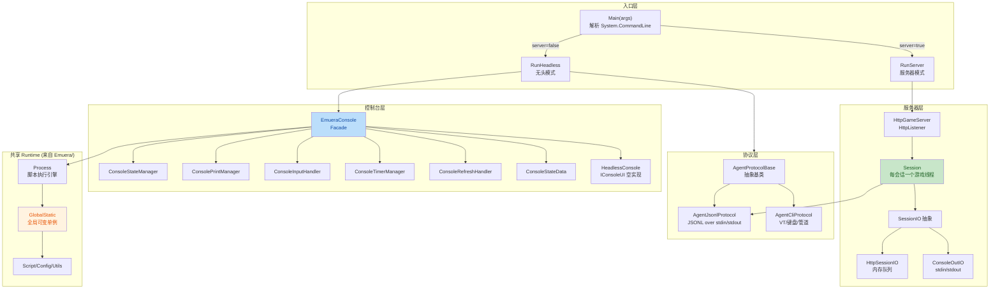
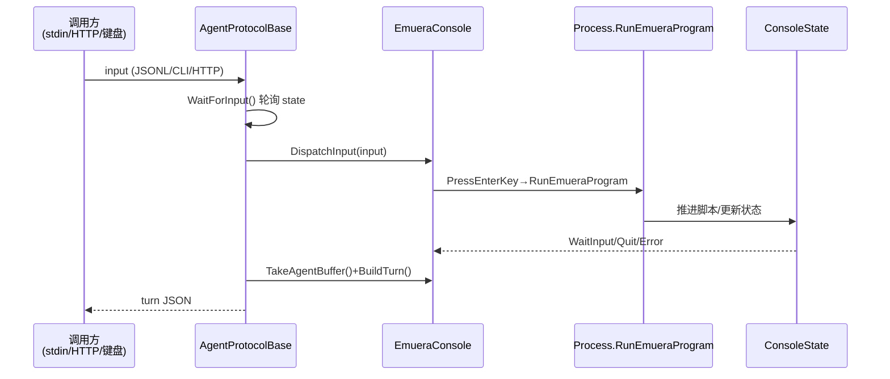

# Emuera.Headless 架构健壮性评估报告

## 一、架构总览

Emuera.Headless 是 Emuera（Eramaker 引擎的 C# 移植版）的无头模式运行器，通过共享源码 + 协议层适配的方式，在不依赖 WinForms 的前提下提供 CLI / JSONL / HTTP Server 三种交互通道。

### 架构分层

### 协议层调用序列

***

## 二、架构优势

1. **协议层抽象清晰**：[AgentProtocolBase.cs](file:///d:/LaoBro/Emuera.MCP/Emuera.Headless/Agent/AgentProtocolBase.cs) 通过 `GetInitialTurn/Step/SubmitTimeout` 三个核心方法抽象了"驱动游戏一回合"的协议契约，CLI/JSONL/Server 三种模式复用同一套 `RunLoop`。
2. **Facade + Manager 分层**：[EmueraConsole.cs](file:///d:/LaoBro/Emuera.MCP/Emuera.Headless/UI/Game/EmueraConsole.cs) 作为 facade 把状态/打印/输入/定时器/刷新拆到 6 个 manager，单一职责清晰。
3. **IConsoleUI 抽象**：[IConsoleUI.cs](file:///d:/LaoBro/Emuera.MCP/Emuera/UI/Game/IConsoleUI.cs) 把 WinForms 依赖隔离到接口背后，HeadlessConsole 提供空实现，避免了 WinForms 在无头环境的耦合。
4. **SessionIO 抽象**：[SessionIO.cs](file:///d:/LaoBro/Emuera.MCP/Emuera.Headless/Server/SessionIO.cs) 让 JSONL 协议同时支持 stdin 管道与 HTTP 内存队列，复用 `RunLoop`。
5. **文档化技术债务**：[docs/TODO.md](file:///d:/LaoBro/Emuera.MCP/docs/TODO.md) 与 [docs/LESSONS/](file:///d:/LaoBro/Emuera.MCP/docs/LESSONS/) 明确记录了已知问题与踩坑教训，团队对债务有清晰认知。

***

## 三、关键问题清单

| 编号   | 严重度   | 问题                                                                                                                                           | 建议                                                                                                                                     | 代码位置                                                                                                                                                                                                           |
| ---- | ----- | -------------------------------------------------------------------------------------------------------------------------------------------- | -------------------------------------------------------------------------------------------------------------------------------------- | -------------------------------------------------------------------------------------------------------------------------------------------------------------------------------------------------------------- |
| I-01 | 🔴 高  | 共享源码用 `<Compile Include="..\Emuera\...">` glob 而非 ProjectReference，无编译期封装边界；Emuera 源码改动可静默破坏 Headless 构建                                     | 抽取 `Emuera.Core` 类库项目（Runtime/Script/Config），Headless 与 Emuera 都 ProjectReference 它；保留 `#if HEADLESS` 仅用于真正平台相关分支                      | [Emuera.Headless.csproj:19-46](file:///d:/LaoBro/Emuera.MCP/Emuera.Headless/Emuera.Headless.csproj#L19-L46)                                                                                                    |
| I-02 | 🔴 高  | `GlobalStatic` 是 god-object，所有静态字段（Process/Console/VariableData/EMediator…）可变且全局共享；Headless 服务器模式无法安全支持多会话                                   | 通过构造注入或 `IGameRuntime` 上下文接口逐步替换；至少先把 server 模式标注为"单会话不可变全局"的硬约束并加运行时断言                                                                | [GlobalStatic.cs:17-46](file:///d:/LaoBro/Emuera.MCP/Emuera/GlobalStatic.cs#L17-L46)                                                                                                                           |
| I-03 | 🔴 高  | HttpGameServer 只支持单会话（`_session` 单字段 + `_sessionLock`），但 `_ioMap` 是 ConcurrentDictionary 暗示本应多会话；架构意图与实现不一致                                  | 明确单会话契约并移除 `_ioMap`；或改为真正的 `ConcurrentDictionary<string, Session>` 支持多会话（需先解决 I-02）                                                    | [HttpGameServer.cs:13-17](file:///d:/LaoBro/Emuera.MCP/Emuera.Headless/Server/HttpGameServer.cs#L13-L17)                                                                                                       |
| I-04 | 🔴 高  | 21 处空 `catch {}` 吞掉所有异常，调试困难、问题被掩盖                                                                                                           | 至少 `catch (Exception ex) { AgentLog.Instance.Write(ex.ToString()); }`；对真正预期可忽略的 IO 异常单独写 `catch (IOException)` 并注释原因                   | [AgentCliProtocol.cs:300,328,331](file:///d:/LaoBro/Emuera.MCP/Emuera.Headless/Agent/AgentCliProtocol.cs#L300-L331)、[Program.cs:250,379](file:///d:/LaoBro/Emuera.MCP/Emuera.Headless/Program.cs#L250) 等 21 处  |
| I-05 | 🟠 中高 | Session 用裸 `Thread` 跑游戏循环，`EmueraConsole.Initialize().Wait()` 是 sync-over-async，会触发 `InvalidOperationException` 在某些 SynchronizationContext 下 | 改为 `async Task GameLoopAsync()` + `await _console.InitializeAsync()`；或把 `Initialize` 改为同步方法                                            | [Session.cs:33-46](file:///d:/LaoBro/Emuera.MCP/Emuera.Headless/Server/Session.cs#L33-L46)、[Program.cs:158](file:///d:/LaoBro/Emuera.MCP/Emuera.Headless/Program.cs#L158)                                      |
| I-06 | 🟠 中高 | 长轮询 turn 端点用 `Thread.Sleep(50)` 忙等 25 秒，每个请求阻塞一个线程池线程                                                                                        | 改为 `Channel<string>` 或 `BufferBlock<string>` + `await ReceiveAsync(timeoutCt)`；HTTP 端点改为 async                                         | [HttpGameServer.cs:97-110](file:///d:/LaoBro/Emuera.MCP/Emuera.Headless/Server/HttpGameServer.cs#L97-L110)                                                                                                     |
| I-07 | 🟠 中高 | 已知 BUG T-014：CLI 模式游戏进入 Quit/Error 后 `RunCliLoop` 不调用 `Stop()`，真实交互 CLI 空转                                                                   | 在 `RunAgentLoop` 末尾检查 `console.State`，Quit/Error 时 `Stop()`；TODO.md 已记录但未修复                                                            | [AgentCliProtocol.cs:131-156](file:///d:/LaoBro/Emuera.MCP/Emuera.Headless/Agent/AgentCliProtocol.cs#L131-L156)                                                                                                |
| I-08 | 🟠 中高 | 已知 BUG T-016：`Step()` 捕获异常返回 error JSON 后协议继续运行；`SubmitTimeout()` 不等 `WaitForInput()` 即返回半运行态 turn                                           | 异常后调用 `Stop()` 或标记 fatal；`SubmitTimeout()` 后调 `WaitForInput()` 再 `BuildTurn()`                                                         | [AgentJsonlProtocol.cs:54-89](file:///d:/LaoBro/Emuera.MCP/Emuera.Headless/Agent/AgentJsonlProtocol.cs#L54-L89)                                                                                                |
| I-09 | 🟠 中  | 零 C# 单元测试，所有测试为 Python 黑盒集成测试，依赖 `test_game/erb/TEST.ERB` fixture；无法隔离测试 Agent/Server 单元                                                     | 增加 xUnit 项目，针对 AgentJsonlProtocol/SessionIO/HttpGameServer 的纯逻辑路径（turn 序列化、按钮收集、超时）写单测；用接口注入替换 `Console.In`/`Program.AnsiEnabled` 静态依赖 | [tests/](file:///d:/LaoBro/Emuera.MCP/tests/)                                                                                                                                                                  |
| I-10 | 🟠 中  | `AgentLog` 是 `Lazy<>` 单例，server 模式多会话共享同一文件句柄（与 I-03 叠加）；普通模式日志路径依赖 `Program.ExeDir` 静态                                                      | 改为可注入 `ILogger`，每会话独立 logger；或至少在 server 模式禁用单例日志                                                                                      | [AgentLog.cs:10-14](file:///d:/LaoBro/Emuera.MCP/Emuera.Headless/Agent/AgentLog.cs#L10-L14)                                                                                                                    |
| I-11 | 🟠 中  | HeadlessConsole.Close/ExitApplication 直接 `Environment.Exit(0)`，无法在 server 模式被复用、无法测试、绕过 Dispose 链                                            | 改为抛 `GameExitException` 或调用 `CancellationTokenSource.Cancel()`，由顶层循环统一退出                                                               | [HeadlessConsole.cs:28-29](file:///d:/LaoBro/Emuera.MCP/Emuera/UI/Game/HeadlessConsole.cs#L28-L29)                                                                                                             |
| I-12 | 🟠 中  | csproj 缺少质量护栏：无 `<Nullable>enable</Nullable>`、无 `<EnableNETAnalyzers>`、无 `<TreatWarningsAsErrors>`；Emuera 主项目有，Headless 没有                   | 与 Emuera.csproj 对齐质量设置；nullable 可分阶段启用（先 `enable` + `warnings`）                                                                        | [Emuera.Headless.csproj:1-13](file:///d:/LaoBro/Emuera.MCP/Emuera.Headless/Emuera.Headless.csproj#L1-L13)                                                                                                      |
| I-13 | 🟡 中低 | 依赖版本不一致：TargetFramework `net10.0`，但 `System.Drawing.Common` 锁定 `9.0.0`；`System.CommandLine` 用 `2.0.0-beta4.22272.1`（3 年前的 beta）              | 升级 `System.Drawing.Common` 到 10.0.x；评估 `System.CommandLine` 正式版或迁移到 `System.CommandLine` 2.0 GA                                        | [Emuera.Headless.csproj:13-16](file:///d:/LaoBro/Emuera.MCP/Emuera.Headless/Emuera.Headless.csproj#L13-L16)                                                                                                    |
| I-14 | 🟡 中低 | `IConsoleUI` 抽象泄漏：`ToolTipDrawEventArgs.Graphics` 暴露 `System.Drawing.Graphics`，HeadlessConsole 实现仍需引用 System.Drawing.Common                  | 把 Graphics 抽象为 `IGraphicsCanvas`，或 Headless 路径根本不触发 ToolTip Draw 事件（标注 `notsupported`）                                                 | [IConsoleUI.cs:81-86](file:///d:/LaoBro/Emuera.MCP/Emuera/UI/Game/IConsoleUI.cs#L81-L86)                                                                                                                       |
| I-15 | 🟡 中低 | HttpGameServer 500 错误直接返回 `ex.Message`，存在信息泄露；无请求体大小限制；JSONL 输入 `catch { continue; }` 静默丢弃畸形输入                                               | 500 返回固定 `"internal error"`，详细写日志；JSONL 畸形输入回写一行 `{"error":"invalid json"}`                                                            | [HttpGameServer.cs:230](file:///d:/LaoBro/Emuera.MCP/Emuera.Headless/Server/HttpGameServer.cs#L230)、[AgentJsonlProtocol.cs:144](file:///d:/LaoBro/Emuera.MCP/Emuera.Headless/Agent/AgentJsonlProtocol.cs#L144) |
| I-16 | 🟡 中低 | `Program.cs` 把 P/Invoke（CreateFileW/GetConsoleMode…）与业务流混合在一个文件，单文件 \~500+ 行                                                                 | 抽出 `WindowsConsoleInterop.cs` 到 Agent/，Program 只调用 `TrySetupWindowsConsole()`                                                          | [Program.cs:455-505](file:///d:/LaoBro/Emuera.MCP/Emuera.Headless/Program.cs#L455-L505)                                                                                                                        |
| I-17 | 🟡 低  | `EmueraConsole` 声明为 `partial` 但只有一个文件，`partial` 多余；两份 `.sln`（`Emuera/Emuera.sln` 与根 `Emuera.sln`）易混淆                                         | 删除 `partial` 修饰符；确认根 sln 为唯一入口并删除 Emuera/Emuera.sln 或在 README 明确分工                                                                     | [EmueraConsole.cs:19](file:///d:/LaoBro/Emuera.MCP/Emuera.Headless/UI/Game/EmueraConsole.cs#L19)                                                                                                               |
| I-18 | 🟡 低  | `Emuera.Headless.csproj.user` 提交了 `_LastSelectedProfileId`，应被 `.gitignore`                                                                   | 把 `*.csproj.user` 加入 `.gitignore`                                                                                                      | [Emuera.Headless.csproj.user:4](file:///d:/LaoBro/Emuera.MCP/Emuera.Headless/Emuera.Headless.csproj.user#L4)                                                                                                   |

***

## 四、按主题的深度评估

### 4.1 代码组织与模块化（I-01, I-16, I-17）

当前通过 csproj glob 共享源码是一种"伪模块化"——没有 assembly 边界，`internal` 可见性失效，Headless 与 Emuera 共享所有 internal 成员。这导致：

- Headless 任意文件能直接访问 `Runtime/Script/Statements` 的 internal 类，难以约束依赖方向
- Emuera 主项目重命名/移动文件会静默破坏 Headless（编译期不会报错，因为 glob 不匹配就 silently 排除）
- `#if HEADLESS` 与共享源码叠加，使同一文件有两条编译路径，长期维护成本高

**推荐路径**：抽取 `Emuera.Core.csproj`（net10.0，无 WinForms 依赖）承载 Runtime/Script/Config/UI-Game-非Forms 部分；Emuera 与 Emuera.Headless 都 ProjectReference 它。这是支持新功能开发前最该做的一次性投资。

### 4.2 错误处理与可观测性（I-04, I-08, I-10, I-15）

错误处理是当前最薄弱的环节：

- 21 处空 catch 等同于"假装成功"，与 [LESSONS/README.md](file:///d:/LaoBro/Emuera.MCP/docs/LESSONS/) 中记录的多个 bug 根因一致
- 没有统一的 `ILogger` 抽象，`AgentLog` 仅在环境变量开启时才写文件
- server 模式下 Session 异常只写入输出队列，调用方可能拿不到 error turn（若已 Close）
- HTTP 500 泄露 `ex.Message`

**最小改进**：引入 `Microsoft.Extensions.Logging` 抽象（不一定引入 DI 容器），把空 catch 替换为 `_logger.LogWarning(ex, "ctx")`；HTTP 500 返回固定文案。

### 4.3 并发与生命周期（I-02, I-03, I-05, I-06, I-11）

- `GlobalStatic` 可变静态字段是 server 多会话的根本障碍
- HttpGameServer 的"单会话 + ConcurrentDictionary"矛盾暗示设计意图被实现截断
- sync-over-async（`.Wait()`）与裸 `Thread` 表明异步模型不统一
- `Environment.Exit(0)` 绕过正常 Dispose 链

**短期**：明确 server = 单会话契约，移除 `_ioMap`，文档化"多会话需先重构 GlobalStatic"。
**中期**：把 `EmueraConsole.Initialize` 改为同步或全程 `async Task`；`Session` 改用 `Task` + `CancellationToken`。

### 4.4 性能与发布配置（I-06, I-12, I-13）

- 启动期 `TerminalDisplayWidth.DetectCharWidths()` 每次都探测，可缓存到文件（`%LocalAppData%/Emuera/term-width.cache`）
- 长轮询忙等（I-06）是 server 模式主要瓶颈
- [FolderProfile.pubxml](file:///d:/LaoBro/Emuera.MCP/Emuera.Headless/Properties/PublishProfiles/FolderProfile.pubxml) 设置 `SelfContained=false` + `PublishReadyToRun=true`，但 csproj 未声明 `RuntimeIdentifier`，ReadyToRun 需要 RID — 依赖 pubxml 透传，配置分散易错
- 缺少 `EnableNETAnalyzers`，相比 Emuera 主项目少了静态分析护栏

### 4.5 测试覆盖（I-09）

- 全部为 Python 端到端测试，依赖编译产物 + `test_game` fixture
- 任何 C# 单元逻辑改动都需要 `dotnet build` + Python 才能验证，反馈链长
- 无法测试：JSON 序列化、按钮收集、超时状态机、SessionIO 队列语义等纯逻辑

**建议**：新增 `Emuera.Headless.Tests` xUnit 项目，先把 `AgentJsonlProtocol.BuildTurn`/`CollectVisibleButtons`、`HttpSessionIO` 队列、`TerminalDisplayWidth` 查表这类纯函数覆盖单测，再逐步扩展到协议状态机。

### 4.6 安全（I-15）

本地开发场景下风险可控，但若 server 模式被部署到非 localhost：

- 无认证
- `HttpListener` 仅绑 `localhost` 是当前唯一防线
- 500 错误泄露 `ex.Message`

**建议**：增加 `--bind 127.0.0.1` 显式参数；可选 token 认证（`--auth-token`）；500 固定文案。

***

## 五、优先级路线图

### P0 — 新功能开发前必须修复

1. **I-07（T-014）**：CLI 游戏结束空转 BUG — 影响所有交互式使用
2. **I-08（T-016）**：协议异常后继续运行 — 影响所有模式稳定性
3. **I-04**：空 catch 至少加日志 — 否则新功能出问题无法定位

### P1 — 新功能开发期间应完成

1. **I-01**：抽取 Emuera.Core 类库 — 一次性投资，之后每个新功能都受益
2. **I-02 + I-03**：明确 server 单会话契约或重构 GlobalStatic — 决定能否支持多会话新功能
3. **I-05 + I-06**：async/await 化 Session 与长轮询 — server 模式性能前提
4. **I-09**：建立 C# 单元测试项目 — 新功能必须有单测

### P2 — 持续改进

1. **I-11, I-15, I-16**：生命周期/安全/Program 拆分
2. **I-12, I-13, I-14**：质量护栏、依赖升级、抽象泄漏
3. **I-10**：可注入 logger
4. **I-17, I-18**：清理 partial/sln/csproj.user

***

## 六、结论

Emuera.Headless 的**协议层与 Facade 分层设计是健康的**，[docs/TODO.md](file:///d:/LaoBro/Emuera.MCP/docs/TODO.md) 与 [docs/LESSONS/](file:///d:/LaoBro/Emuera.MCP/docs/LESSONS/) 显示团队对技术债务有清晰认知。但在**新功能开发前**存在三个结构性风险：

1. \*\*共享源码 glob（I-01）\*\*让两个项目耦合过紧，任何 Emuera 改动都可能破坏 Headless；
2. \*\*GlobalStatic 全局可变状态（I-02）+ server 单会话矛盾（I-03）\*\*限制了 server 模式的扩展空间；
3. \*\*空 catch + 零单测（I-04, I-09）\*\*让回归风险随新功能线性增长。

**建议在开发新功能前先完成 P0 三项**（半天到一天工作量），并在第一个新功能落地时同步推进 P1 的 I-01（抽 Core 类库）。这样能在保留现有协议层优点的前提下，给新功能一个稳定、可测、可扩展的底座。

如需我针对其中任何一项给出具体重构方案或开始实施，请告知。
